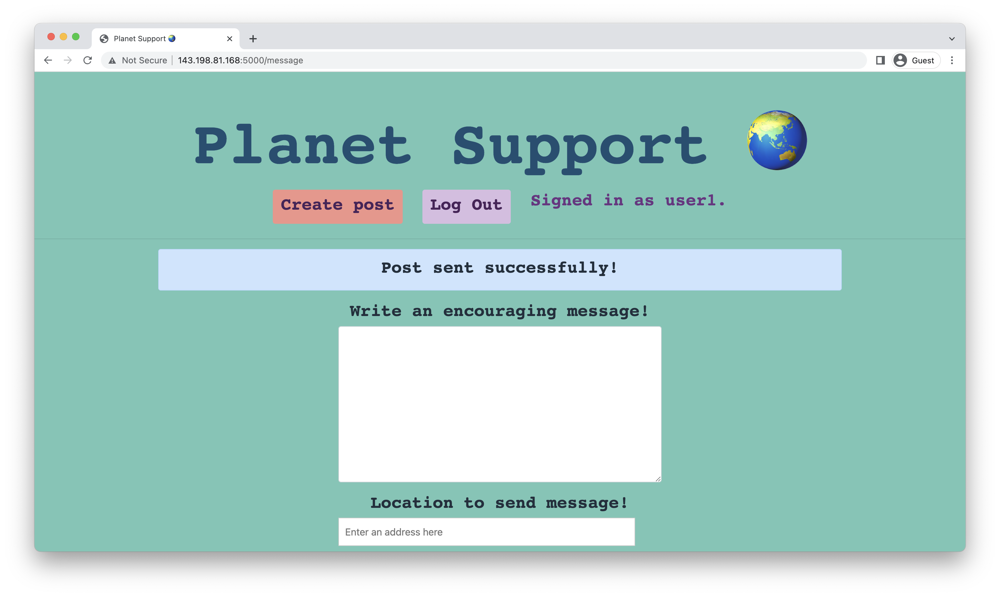

# wetryourbest's post page



[Geoapify Address Autocomplete API](https://apidocs.geoapify.com/samples/autocomplete/geoapify-geocoder-autocomplete/)

[pysentimiento](https://github.com/pysentimiento/pysentimiento)

## Citations
```bibtex
@misc{perez2021pysentimiento, title={pysentimiento: A Python Toolkit for Sentiment Analysis and SocialNLP tasks}, author={Juan Manuel Pérez and Juan Carlos Giudici and Franco Luque}, year={2021}, eprint={2106.09462}, archivePrefix={arXiv}, primaryClass={cs.CL} } % Hate Speech Detection % Spanish & English

@inproceedings{hateval2019semeval, title={SemEval-2019 Task 5: Multilingual Detection of Hate Speech Against Immigrants and Women in Twitter}, author={Basile, Valerio and Bosco, Cristina and Fersini, Elisabetta and Nozza, Debora and Patti, Viviana and Rangel, Francisco and Rosso, Paolo and Sanguinetti, Manuela}, booktitle={Proceedings of the 13th International Workshop on Semantic Evaluation (SemEval-2019)}, year={2019}, publisher= {Association for Computational Linguistics} }
```
